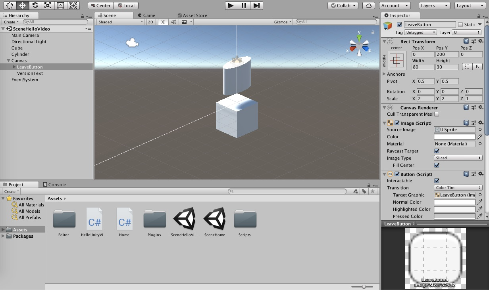
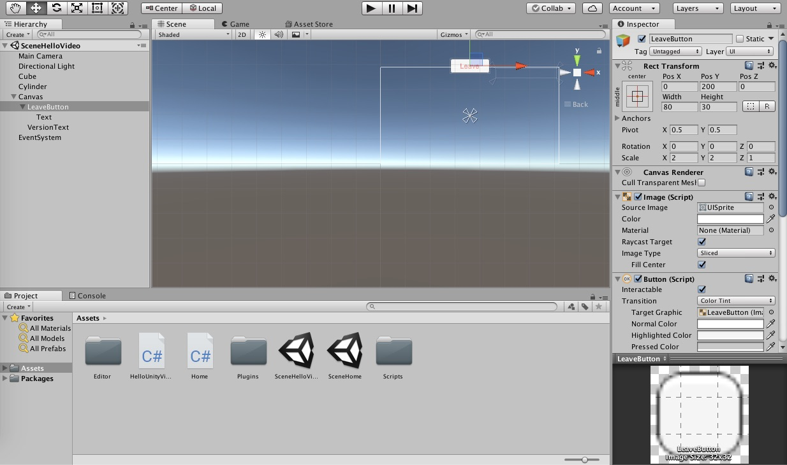
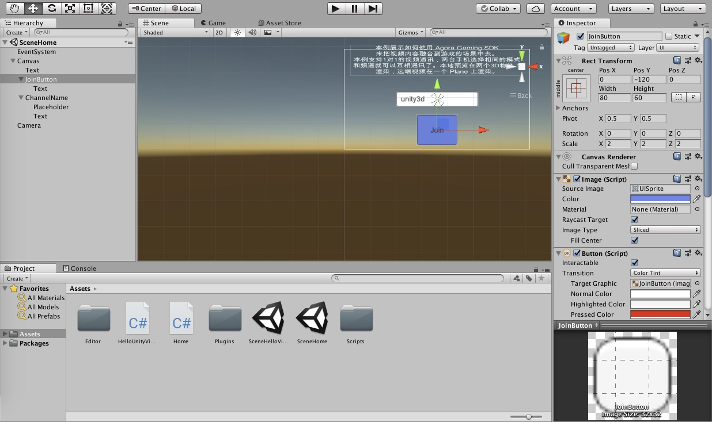

# Hello Video Agora for Unity

This tutorial enables you to quickly get started with using a sample app to develop requests to the Agora Gaming SDK in [Unity 3D](https://unity3d.com).

This sample app demonstrates the basic Agora SDK feature:

- [Join a Channel](#create-the-join-method)
- [Leave a Channel](#create-the-leave-method)


## Prerequisites
- Agora.io Developer Account
- Unity 3D 5.5+


## Quick Start
This section shows you how to prepare and build the Agora React Native wrapper for the sample app.

### Create an Account and Obtain an App ID
In order to build and run the sample application you must obtain an App ID: 

1. Create a developer account at [agora.io](https://dashboard.agora.io/signin/). Once you finish the signup process, you will be redirected to the Dashboard.
2. Navigate in the Dashboard tree on the left to **Projects** > **Project List**.
3. Copy the App ID that you obtained from the Dashboard into a text file. You will use this when you launch the app.

### Update and Run the Sample Application 

1. Edit the [`Assets/HelloUnityVideo.cs`](Assets/HelloUnityVideo.cs) file. In the `HelloUnityVideo` class declaration, update `#YOUR APP ID#` with your App ID.

	`private static string appId = #YOUR APP ID#;`

2. Download the [Agora Gaming SDK](https://www.agora.io/en/download/) for Unity 3D.

	

3. Unzip the downloaded SDK package and copy the files from the following SDK folders into the associated sample application folders.

SDK Folder|Application Folder
---|---
`libs/Android/`|`Assets/Plugins/Android/`
`libs/iOS/`|`Assets/Plugins/iOS/`
`libs/Scripts/AgoraGamingSDK/`|`Assets/Scripts/AgoraGamingSDK/`

4. Open the project in Unity and run the sample application.

## Steps to Create the Sample

The sample application is comprised of two main classes, `HelloUnityVideo` and `Home`.

- [Create the Scenes](#create-the-scenes)
- [Create the HelloUnityVideo Class](#create-the-hellounityvideo-class)
- [Create the Home Class](#create-the-home-class)

### Create the Scenes

The sample application consists of two main Unity scenes.

#### Create SceneHelloVideo

When you load `SceneHelloVideo` in Unity, you'll see that the stage contains a cylindrical object and a cube object.



The scene also contains a **Leave** button.

**Note:** You may have to zoom out and adjust the camera view in order to see the leave button in the stage.



#### Create SceneHome

When you load `SceneHome` in Unity, you will see the stage contains:

UI object|Description
---|---
Text object|Explanation text for the user to read
Text input box|Text input box for the user to enter the channel name
**Join** button|Button to join the channel

**Note:** You may have to zoom out and adjust the camera view in order to see the leave button in the stage.



### Create the HelloUnityVideo Class

The `HelloUnityVideo` class is a subclass of `MonoBehaviour`. The [`HelloUnityVideo.cs`](Assets/HelloUnityVideo.cs) file contains the relevant Agora SDK code for the Unity 3D sample application.

```
using System.Collections;
using System.Collections.Generic;
using UnityEngine;
using agora_gaming_rtc;
using UnityEngine.UI;

public class HelloUnityVideo : MonoBehaviour {

	...
	
}
```

The remaining code in this section are contained within the `HelloUnityVideo` class declaration.

- [Declare Global Variables](#declare-global-variables)
- [Load / Unload Engine Methods](#load-unload-engine-methods)
- [Join / Leave Channel Methods](#join-leave-channel-methods)
- [Create General Event Listeners](#create-general-event-listeners)
- [Create User Event Listeners](#create-user-event-listeners)


#### Declare Global Variables

The `HelloUnityVideo` class has three global variables and one method that acts as a declaration for the SDK version constant.

The `appId` variable is initialized with the Agora App ID from your Agora Dashboard.

**Note:** `#YOUR APP ID#` must be replaced with a valid Agora App ID.

```
	// PLEASE KEEP THIS App ID IN SAFE PLACE
	// Get your own App ID at https://dashboard.agora.io/
	// After you entered the App ID, remove ## outside of Your App ID
	private static string appId = #YOUR APP ID#;
```

Declare the `mRtcEngine` variable, which represents the Agora RTC engine for the application.

Initialize `mRemotePeer` to `0` which will track the index of the current remove user for the applicaiton.

```
	// instance of agora engine
	public IRtcEngine mRtcEngine;

	// implement engine callbacks

	public uint mRemotePeer = 0; // insignificant. only record one peer
```

The `getSdkVersion()` method returns the SDK version from the Agora RTC engine using `IRtcEngine.GetSdkVersion()`.

```
	public string getSdkVersion () {
		return IRtcEngine.GetSdkVersion ();
	}
```

#### Load / Unload Engine Methods

The `HelloUnityVideo` class has two methods for loading / unloading the Agora RTC engine.

##### Create the Load Engine Method

The `loadEngine()` method initializes the Agora RTC engine.

1. Set debugging logs for the method initialization and if `mRtcEngine` is not `null`. If `mRtcEngine` exists, execute a `return` as the RTC engine has already been initalized.

2. Initialize the engine with the `appId` using `IRtcEngine.getEngine()`

3. Enable Agora logging by setting the following log filters using `mRtcEngine.SetLogFilter()`

Filter|Description
---|---
`LOG_FILTER.DEBUG`|Sets the Agora debugging logs
`LOG_FILTER.INFO`|Sets the Agora information logs
`LOG_FILTER.WARNING`|Sets the Agora warning logs
`LOG_FILTER.ERROR`|Sets the Agora error logs
`LOG_FILTER.CRITICAL`|Sets the Agora critical error logs

```
	// load agora engine
	public void loadEngine()
	{
		// start sdk
		Debug.Log ("initializeEngine");

		if (mRtcEngine != null) {
			Debug.Log ("Engine exists. Please unload it first!");
			return;
		}

		// init engine
		mRtcEngine = IRtcEngine.getEngine (appId);

		// enable log
		mRtcEngine.SetLogFilter (LOG_FILTER.DEBUG | LOG_FILTER.INFO | LOG_FILTER.WARNING | LOG_FILTER.ERROR | LOG_FILTER.CRITICAL);
	}
```

##### Create the Unload Engine Method

The `unloadEngine()` method destroys the Agora RTC engine.

1. Set debugging logs for the method initialization

2. Ensure `mRtcEngine` is not `null` before destroying the engine using `IRtcEngine.Destroy()` and setting `mRtcEngine` to `null`

```
	// unload agora engine
	public void unloadEngine()
	{
		Debug.Log ("calling unloadEngine");

		// delete
		if (mRtcEngine != null) {
			IRtcEngine.Destroy ();
			mRtcEngine = null;
		}
	}
```

#### Join / Leave Channel Methods

The `HelloUnityVideo` class has two methods to manage joining and leaving a channel.

##### Create the Join Method

The `join()` method joins the user to the specified `channel`, sets event listeners, and configures the Agora RTC engine settings.

1. Set a debug log for the `channel` name using `Debug.Log()` and ensure `mRtcEngine` is not `null` before executing the remaining code for the method.

2. Set the following callbacks for `mRtcEngine`:

	**Note:** These callback are optional for the sample application, but are useful for extending the functionality of the application.

Event Listener|Method Value|Description
---|---|---
`OnJoinChannelSuccess`|`onJoinChannelSuccess`|Detects when the channel is successfully joined
`OnUserJoined`|`onUserJoined`|Detects when a user successfully joins the channel
`OnUserOffline`|`onUserOffline`|Detects when a user goes offline

3. Enable video and set its callback using `mRtcEngine.EnableVideo()` and `mRtcEngine.EnableVideoObserver()`.

4. Join the channel using `mRtcEngine.JoinChannel()`.

5. Set a debug log for the method completion using `Debug.Log()`.

```
	public void join(string channel)
	{
		Debug.Log ("calling join (channel = " + channel + ")");

		if (mRtcEngine == null)
			return;

		// set callbacks (optional)
		mRtcEngine.OnJoinChannelSuccess = onJoinChannelSuccess;
		mRtcEngine.OnUserJoined = onUserJoined;
		mRtcEngine.OnUserOffline = onUserOffline;

		// enable video
		mRtcEngine.EnableVideo();

		// allow camera output callback
		mRtcEngine.EnableVideoObserver();

		// join channel
		mRtcEngine.JoinChannel(channel, null, 0);

		Debug.Log ("initializeEngine done");
	}
```

##### Create the Leave Method

The `leave()` method exits the user to the current channel.

1. Set a debug log to track the method call using `Debug.Log()` and ensure `mRtcEngine` is not `null` before executing the remaining code for the method.

2. Leave the channel using `mRtcEngine.LeaveChannel()`.

3. Unregister the frame observers using `mRtcEngine.DisableVideoObserver()`.

```
	public void leave()
	{
		Debug.Log ("calling leave");

		if (mRtcEngine == null)
			return;

		// leave channel
		mRtcEngine.LeaveChannel();
		// deregister video frame observers in native-c code
		mRtcEngine.DisableVideoObserver();
	}
```

#### Create General Event Listeners

The `HelloUnityVideo` class has two event listeners to manage video loading and transform events.

##### Create the Video Loaded Event Listener

The `onSceneHelloVideoLoaded()` delegate method detects when the scene loads.

Set `go` to the `GameObject` with the name `Cylinder`.

- If `go` is `null`, set a debug log for the missing `GameObject` using `Debug.Log()` and end the method execution.

- If `go` is not `null`

	1. Create a new `VideoSurface` object using  `go.GetComponent<VideoSurface> ()`
	2. Add `onTransformDelegate` to the existing  `o.mAdjustTransfrom` value.

```
	// accessing GameObject in Scnene1
	// set video transform delegate for statically created GameObject
	public void onSceneHelloVideoLoaded()
	{
		GameObject go = GameObject.Find ("Cylinder");
		if (ReferenceEquals (go, null)) {
			Debug.Log ("BBBB: failed to find Cylinder");
			return;
		}
		VideoSurface o = go.GetComponent<VideoSurface> ();
		o.mAdjustTransfrom += onTransformDelegate;
	}
```

##### Create the Transform Event Listener

The `onTransformDelegate()` delegate method detects transform changes for a `GameObject`.

- If `uid` is equal to `0` set the following `transform` properties:

Transform Property|Value|Description
---|---|---
`position`|`new Vector3 (0f, 2f, 0f)`|Transform position
`localScale`|`new Vector3 (2.0f, 2.0f, 1.0f)`|Transform scale on the local level
`Rotate`|`0f, 1f, 0f`|Transform rotation

- Otherwise, set the rotate transform property to `0.0f, 1.0f, 0.0f` using `transform.Rotate()`. 

```
	// delegate: adjust transfrom for game object 'objName' connected with user 'uid'
	// you could save information for 'uid' (e.g. which GameObject is attached)
	private void onTransformDelegate (uint uid, string objName, ref Transform transform)
	{
		if (uid == 0) {
			transform.position = new Vector3 (0f, 2f, 0f);
			transform.localScale = new Vector3 (2.0f, 2.0f, 1.0f);
			transform.Rotate (0f, 1f, 0f);
		} else {
			transform.Rotate (0.0f, 1.0f, 0.0f);
		}
	}
```

#### Create User Event Listeners

The `HelloUnityVideo` class has three event listeners to manage users joining and leaving a channel.

##### Create the Join Success Event Listener

The `onJoinChannelSuccess()` event listener detects when the channel is successfully joined.

1. Set a debug log for the user's `uid` that joins the channel using `Debug.Log ()`.

2. Retrieve the `GameObject` with the name `VersionText` using `GameObject.Find()`.

3. Set the text for `textVersionGameObject.GetComponent<Text> ()` as the SDK version specified by `getSdkVersion ()`.

```
	private void onJoinChannelSuccess (string channelName, uint uid, int elapsed)
	{
		Debug.Log ("JoinChannelSuccessHandler: uid = " + uid);
		GameObject textVersionGameObject = GameObject.Find ("VersionText");
		textVersionGameObject.GetComponent<Text> ().text = "Version : " + getSdkVersion ();
	}
```

##### Create the Remote User Join Event Listener

The `onUserJoined()` event listener detects when a remote user joins the channel.

Set a debug log for the remote user's `uid` that joins the channel using `Debug.Log ()` and retrieve the `GameObject` with the name `uid.ToString()` using `GameObject.Find()`.

If `go` is `null`, set its `name` property to `uid.ToString ()` and create a new `VideoSurface` object using `go.AddComponent<VideoSurface> ()`. Apply the following to `o`

1. Set the user ID using `o.SetForUser()`
2. Add `onTransformDelegate` to the `mAdjustTransfrom` property
3. Enable it by passing `true` into `o.SetEnable()`
4. Set the `transform` property values `Rotate`, `position`, and `localScale`
	
If `go` is not `null`, set `mRemotePeer` to `uid`.


```
	// When a remote user joined, this delegate will be called. Typically
	// create a GameObject to render video on it
	private void onUserJoined(uint uid, int elapsed)
	{
		Debug.Log ("onUserJoined: uid = " + uid);
		// this is called in main thread

		// find a game object to render video stream from 'uid'
		GameObject go = GameObject.Find (uid.ToString ());
		if (!ReferenceEquals (go, null)) {
			return; // reuse
		}

		// create a GameObject and assigne to this new user
		go = GameObject.CreatePrimitive (PrimitiveType.Plane);
		if (!ReferenceEquals (go, null)) {
			go.name = uid.ToString ();

			// configure videoSurface
			VideoSurface o = go.AddComponent<VideoSurface> ();
			o.SetForUser (uid);
			o.mAdjustTransfrom += onTransformDelegate;
			o.SetEnable (true);
			o.transform.Rotate (-90.0f, 0.0f, 0.0f);
			float r = Random.Range (-5.0f, 5.0f);
			o.transform.position = new Vector3 (0f, r, 0f);
			o.transform.localScale = new Vector3 (0.5f, 0.5f, 1.0f);
		}

		mRemotePeer = uid;
	}
```

##### Create the User Offline Event Listener

The `onUserOffline()` event listener detects when a user goes offline.

1. Set a debug log for the user's `uid` that goes offline using `Debug.Log ()`.

2. Retrieve the `GameObject` with the name `uid.ToString()` using `GameObject.Find()`.

3. If `go` is `null`, destroy `go` by passing it into the `Destroy()` method

```
	// When remote user is offline, this delegate will be called. Typically
	// delete the GameObject for this user
	private void onUserOffline(uint uid, USER_OFFLINE_REASON reason)
	{
		// remove video stream
		Debug.Log ("onUserOffline: uid = " + uid);
		// this is called in main thread
		GameObject go = GameObject.Find (uid.ToString());
		if (!ReferenceEquals (go, null)) {
			Destroy (go);
		}
	}
```


### Create the Home Class

The `Home` class is a subclass of `MonoBehaviour`. The [`Home.cs`](Assets/Home.cs) file contains the relevant UI functionality for the Unity 3D sample application created in the [Create the Scenes](#create-the-scenes) section.


```
using System.Collections;
using System.Collections.Generic;
using UnityEngine.SceneManagement;
using UnityEngine.UI;
using UnityEngine;

public class Home : MonoBehaviour {
	
	...
	
}	
```

The remaining code in this section are contained within the `Home` class declaration.

- [Declare Initialization Methods and Variables](#declare-initialization-methods-and-variables)
- [Create Join / Leave UI Functionality](#create-join-leave-ui-functionality)
- [Create Event Listener](#create-event-listener)


#### Declare Initialization Methods and Variables

The `Start()` and `Update()` methods are empty method declarations and can be used for added initialization and update functionality.

```
	// Use this for initialization
	void Start () {
	}

	// Update is called once per frame
	void Update () {
	}
```

The `Home` class declares a single `HelloUnityVideo` object initialized to `null`. This object is used to reference the functionality in the class discussed in the [`HelloUnityVideo`](#create-the-hellounityvideo-class) section.

```
	static HelloUnityVideo app = null;	
```

#### Create Join / Leave UI Functionality

The `onButtonClicked()` method is applied to the **JoinButton** and **LeaveButton** UI objects. This method determines if the user should join or leave the channel.

- If the button's `name` is `JoinButton` invoke `onJoinButtonClicked()`.
- If the button's `name` is `LeaveButton` invoke `onLeaveButtonClicked()`

**Note:** `JoinButton` and `LeaveButton` are the object names in the Unity scenes, not the actual display text shown to the user.

```
	public void onButtonClicked() {
		// which GameObject?
		if (name.CompareTo ("JoinButton") == 0) {
			onJoinButtonClicked ();
		}
		else if(name.CompareTo ("LeaveButton") == 0) {
			onLeaveButtonClicked ();
		}
	}
```

##### Create the Join Button Method

The `onJoinButtonClicked()` method is applied to the **Join** button object.

1. Retrieve the `ChannelName` using `GameObject.Find()`
2. Declare a new `InputField` class using `go.GetComponent<InputField>()`
3. If `app` is equal to `null`, create a new `HelloUnityVideo` class and load the Agora RTC engine using `app.loadEngine()`
4. Join the channel specified by `field.text` using `app.join()`
5. Add `OnLevelFinishedLoading` to the scene loading event listener `SceneManager.sceneLoaded`
6. Load `SceneHelloVideo` using `SceneManager.LoadScene()`

```
	private void onJoinButtonClicked() {
		// get parameters (channel name, channel profile, etc.)
		GameObject go = GameObject.Find ("ChannelName");
		InputField field = go.GetComponent<InputField>();

		// create app if nonexistent
		if (ReferenceEquals (app, null)) {
			app = new HelloUnityVideo (); // create app
			app.loadEngine (); // load engine
		}

		// join channel and jump to next scene
		app.join (field.text);
		SceneManager.sceneLoaded += OnLevelFinishedLoading; // configure GameObject after scene is loaded
		SceneManager.LoadScene ("SceneHelloVideo", LoadSceneMode.Single);
	}
```

##### Create the Leave Button Method

The `onLeaveButtonClicked()` method is applied to the **Leave** button object.

Ensure `app` is not `null` and execute the following:

1. Leave the channel using `app.leave()`
2. Unload the Agora RTC engine using `app.unloadEngine()`
3. Set `app` to `null`
4. Load `SceneHome` using `SceneManager.LoadScene()`

```
	private void onLeaveButtonClicked() {
		if (!ReferenceEquals (app, null)) {
			app.leave (); // leave channel
			app.unloadEngine (); // delete engine
			app = null; // delete app
			SceneManager.LoadScene ("SceneHome", LoadSceneMode.Single);
		}
	}
```

#### Create Event Listener

The `Home` class declares a single event listener `OnLevelFinishedLoading()` to detect when a scene has finished loading. 

If the `scene.name` is `SceneHelloVideo`:

- Ensure `app` is not `null` and invoke `app.onSceneHelloVideoLoaded()` to tell the `HelloUnityVideo` that the scene finished loading.

- Remove the `OnLevelFinishedLoading` event listener from `SceneManager.sceneLoaded`

```
	public void OnLevelFinishedLoading(Scene scene, LoadSceneMode mode) {
		if (scene.name.CompareTo("SceneHelloVideo") == 0) {
			if (!ReferenceEquals (app, null)) {
				app.onSceneHelloVideoLoaded (); // call this after scene is loaded
			}
			SceneManager.sceneLoaded -= OnLevelFinishedLoading;
		}
	}
```

## Resources
- Complete API documentation is available at the [Document Center](https://docs.agora.io/en/).
- You can file bugs about this sample [here](https://github.com/AgoraIO/Hello-Video-Unity-Agora/issues).

## License
This software is under the MIT License (MIT). [View the license](LICENSE.md).